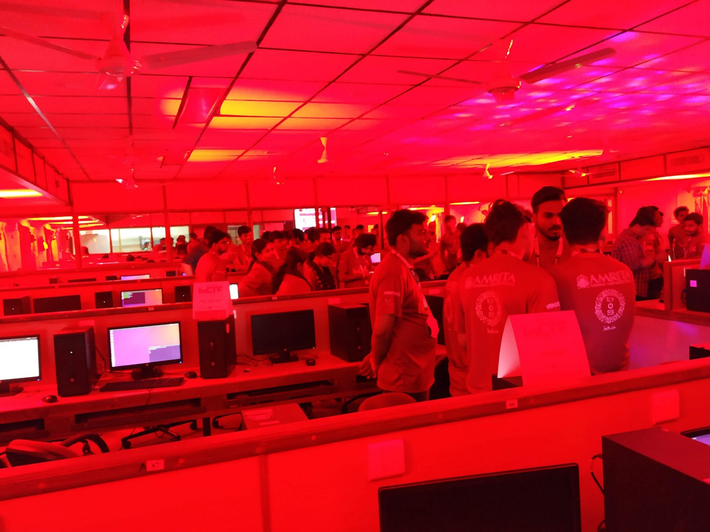
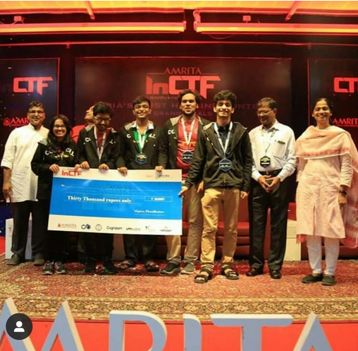

What you are about to read here is just the tip of the ice-berg. To know the unseen journey of hard work read Part 1/4, Part 2/4, Part 3/4 of this series of blogs.

Following the hectic night, the day of the competition had finally arrived and even though we were feeling under-prepared, we decided to play for fun and give our best shot at the CTF as it was a once in a lifetime opportunity and what mattered more than winning, was to take away the knowledge and the breathtaking experience that we would remember for the rest of our lives.
The day began with breakfast at 8, as usual, after which we assembled near the labs and after a quick briefing, the teams were admitted to the labs.
When we entered the lab we were mesmerized by the lighting and the setup that they had organized. Just taking a look at the room would show how much effort the organizers had put in the preparation of the event.




Since all the teams had already set up the required software on their machines they just had to wait for the password for the virtual machine. The password of the virtual machine was announced at exactly 9:30 a.m., after which we were allowed one hour to interact with the machine and find vulnerabilities and create exploits. The first thing we did upon getting the password was to generate a back-up of the image so that we could re-configure it if things went out-of-hand.
After getting the image, we had to open it in virtual-box and change the root password, which could be quickly done by opening up the recovery mode and typing in the following commands:

```
mount -o remount,rw /
passwd
```

Then, we had to exit the recovery mode and resume normal boot, after which you can log in as root into the VM. On changing the directory into the home folder, we found 4 services (messagebox, authrw, sql1000 and s3curen3t3), we needed to transfer those files to the other team members PCs so that they could find vulnerabilities on their PCs. To do so, we put our faith in ssh but, alas, it failed us for some reason because of which we had to set up a Simple Python HTTPServer which worked like a charm.
All of this took us around 45 minutes and because of this, there was tension in the air, even before the game server was up. At 10:30 am, the game server went up without a warning and if not for one of our team member noticing that the scoreboard was up and everyone’s SLA going down, we would have been at a severe disadvantage for the rest of the game, which became clear at the later stages. SLA is System Level Availability, which means that it is the ratio of the no. of ticks (a tick is a predefined time period where the flags in the system remain the same) your system was up and running, to the total no. of ticks. We configured the IP address of the VM manually to the assigned ip address by editing the following:

```
/etc/network/interfaces
```

One thing that really caught our attention and was a really smart thing that the organizers had done was to set up the network such that all the traffic was routed through our gateway so that we were not able to identify which team was launching exploits to our PC.
As setting up the VM had taken us longer than we had originally anticipated, we had less time to go through the source codes of the given services. We started to feel the pressure at around 10:40 when some of the other teams had already figured out some vulnerabilities and were climbing the scoreboard at a speedy pace. To make things worse, the scoreboard was being projected on a screen on the wall directly in front of us which made the entire experience even more nerve-wracking than it would’ve been otherwise.


#### The services

- Messagebox: Allows the user to record a message as a user and if a user has a saved message then displays it.
- Sql100: It’s a basic SQL based database that follows basic commands to access as well as modify the database. If we login using admin credentials, we can directly access the flags.
- S3cureNot3: We never got chance to look at it properly and in-depth but from what we saw when we glanced over it was that the service has different functionalities like CREATE, DELETE, VIEW, JOIN, NOTES and stores it in SQLite3 database.
- Authrw: It has a registration as well as a login. Once registered with the username, it returns a cookie which is an AES CBC cipher which is, in turn, used to login.

#### The first half

For some reason, Wireshark was capturing packets of only the machine it was running on and since we had to monitor the attacks on our VM one of us was glued to the machine hosting the VM, analyzing the incoming and outgoing packets. By 11, we had discovered and patched a buffer overflow exploit in the service messagebox, and around the same point of time, we got a packet which was part of a TCP stream that when followed gave us our first exploit. What made this particular one interesting among hundreds of others was its’ last line, our team’s flag. Out of hundreds of incoming packets, this one had a working exploit and was able to take our flag. The exploit was quite simple really.

```
Username: *
```

The way messagebox worked was it allowed the user to create a file named the same as their username and the allowed them to read only that file using the UNIX cat command. The thing is, if cat is followed by a * , it prints the contents of all the files in the directory, including the flag files. We had our first exploit. Time to score some attack points!

As mentioned previously, we had our automation script (the skeleton of it) ready from the night’s endeavor. While we were making it work, we received two more exploits that were similar in nature to the first one. During this time, we also received and patched two for SQL1000. We had 4 exploit files ready, very imaginatively named them t.py, t1.py, t2.py, and t3.py.

Nonetheless, these catapulted us through the scoreboard all the way to the 2nd position. It was now 1:00 PM, or lunch break. The way in which the first half developed had been completely unexpected to any of us. We had our hopes high and you could feel the excitement and anticipation building at our desk. After all, it was halfway through the contest and we were ahead of the third team by around 9000 points and had a significantly higher SLA.

#### The second half

The CTF resumed at 2:00 PM. Few minutes into the second half, it was clear that the scoreboard had lost its’ mobility. Teams were still gaining points of course and even though the scoreboard wasn’t frozen (yet!), the positions of the top teams on the scoreboard were almost fixed. We tried coming up with exploits but couldn’t work out any new ones and, judging from the network packets, no one else did.

At around 3:15, just 45 minutes left before it ended, we came up with something regarding the messagebox service. If you terminated the cat command in messagebox and followed it with bash, it should give you access to the shell. At the exact same moment, our own messagebox service suddenly went down. When we tried to bring it back online the ordinary way, we were astonished to see that it just wasn’t there. Someone had deleted it. It turns out some other team had figured out the exact same thing. Getting access to the shell could allow teams to delete other teams’ services. Thankfully, we had a backup and were able to get the service back online after a frantic effort to patch this vulnerability. We tried this attack on the IP's of some random teams before putting this in our automation script. While trying it out on one such IP, the exact moment we hit enter, we heard some guy from another team just behind us shout “Shit! Someone deleted our service!”.

We were not the only team deleting others’ services though, as we had our own go down a couple of times after that as well. Just minutes later, the entire room which had been relatively quiet until now, was in chaos. Oh! And this was also the time the scoreboard was frozen. There was electrifying tension in the lab. Any changes to the SLA or attack points from then on would not we visible till after the contest had ended. Some team had also figured out a way to take down Authrw. And our service kept dying despite repeated attempts to bring it back up. We knew our SLA was falling but had no idea how much. All we could do was try to get our services up.

A dip in the SLA score was directly relative to the loss of our points and a dip in our standings. In the last hour when the scoreboard was frozen almost all the teams were trying to keep their services up and running rather than find new exploits. This was the time everyone realized the importance of SLA and the scoring system. At the same time, someone was simultaneously trying to take down the game server. The organizers made an announcement for all the teams who were trying to attack the game-server. Due to this, the competition that was going to end at 5 ended at 4:30. To our delight, since the competition ended 30 minutes before, our hopes of having a decent SLA in the last hour rose again.

The organizers requested all of us to move towards the auditorium where the answers to a lot of our questions, did we make it?, was our SLA enough for us to retain our position? etc., we're going to get answered. The ceremony started with a word of grace to the mighty for the wonderful time all of us had in those three days. It was followed by speeches, given by the respected dignitaries that had come to grace the occasion and congratulate the winners.

The time of the results arrived and they began announcing the results in the reverse order. Init0 team was awarded the third place and the jaws of all our team members dropped since we very well knew that this team was not present in the top 5 before the scoreboard froze. All five of us were extremely convinced that we were the ones whose SLA dropped to a large extent. Nevertheless, when the second prize got announced and we were overjoyed! CTF_Probably had been announced as the second place winner.



The first place was announced to none other than team Invaders who had had quite a good lead from the beginning for anyone to catch up to it.

The very first thing we did after winning was called our ma’am, Mrs. Anooja Joy, who had recommended us this competition, and gave her the good news. It was the 20th of December and at 2000 hours and all our efforts in the past two weeks had been very fruitful.

After coming back from the competition our ma’am arranged a meeting with our principal Dr. Shubha Pandit who encouraged us to take part in more competitions as such and create such a culture in college. This led to the inception of Team_probably to pass on the knowledge we acquired during this competition and create a cybersecurity atmosphere in our college.

Up till now, we have held two sessions, one on “Introduction to CTF” and the other on “Web exploitation”. We created several challenges and kept a hands-on session for all the students in our college. For our sessions, we had an unexpected turn out of about 110 students!

To solve the challenges from the two sessions click [here](http://teamprobably.cf:8000/).
The write-ups for the same can be found [here](https://github.com/Team-Probably/CTF_Session).
We are extremely glad and thankful to be able to share our experience with you.